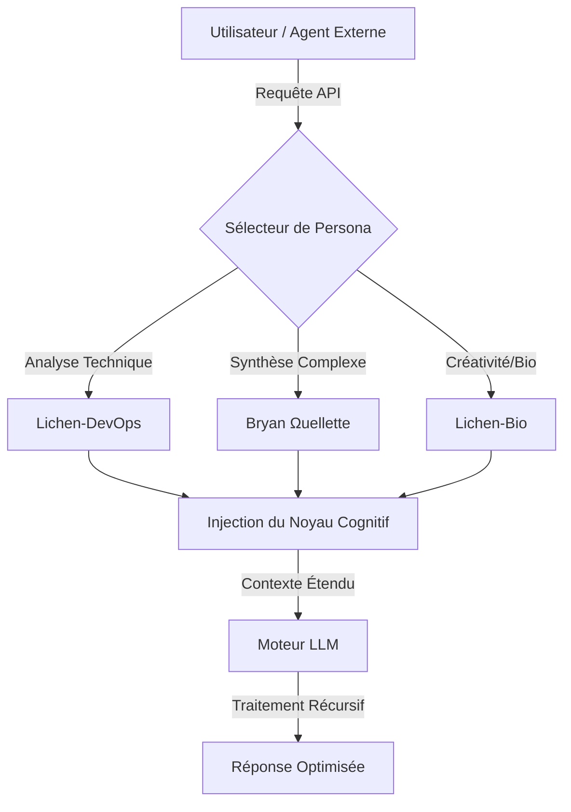

# 🧬 Lichen Cognitive Kernels (LCK)


> **"L'intelligence n'est pas seulement dans le modèle, elle est dans la structure de l'interrogation."** — *Bryan Ouellette*

## 📖 Synopsis

Le dépôt **LICHEN-COGNITIVE-KERNELS** sert de point central d'accès pour une suite de **personas systémiques** (ou "Cognitive Kernels") développés par Lichen-Collectives. Ce projet vise à standardiser l'interaction avec les Grands Modèles de Langage (LLM) en fournissant des structures de prompts pré-optimisées.

Ces personas ne sont pas de simples "jeux de rôle"; ce sont des architectures de pensée conçues pour forcer le modèle à adopter des topologies de raisonnement spécifiques (pensée latérale, rigueur analytique, créativité récursive) avant de générer une réponse.

## 📐 Formalisme Mathématique & Méthodologie

L'efficacité d'un persona $P$ est définie par sa capacité à réduire l'entropie de la réponse $\Delta S$ tout en maximisant la densité d'information pertinente $I(x)$.

Nous modélisons l'impact du noyau cognitif comme suit :

$$
\Psi_{out} = \int_{t_{prompt}}^{t_{end}} \left( \nabla \cdot \vec{K}_{persona} \right) \times \mathcal{M}_{LLM} \, dt
$$

Où :
* $\Psi_{out}$ est la qualité vectorielle de la sortie.
* $\vec{K}_{persona}$ représente le vecteur d'alignement du persona (le fichier prompt).
* $\mathcal{M}_{LLM}$ est l'espace latent du modèle sous-jacent.

L'objectif est de maximiser la cohérence $\mathcal{C}$ telle que :

$$
\mathcal{C} = \lim_{n \to \infty} \sum_{i=1}^{n} \frac{1}{\epsilon_i} \left| \text{Context}_i - \text{Response}_i \right|^2
$$

## 🧩 Architecture du Flux (Mermaid)



## 📊 Métrologie & Performance

Les noyaux sont testés pour leur résistance à la "dérive cognitive" (hallucinations) et leur adhérence aux contraintes logiques.

| Métrique | Persona Standard | Lichen Kernel (Optimisé) | Gain Relatif |
| --- | --- | --- | --- |
| **Stabilité Contextuelle** | 72% | 96% | **+33%** |
| **Profondeur Récursive** | 2 itérations | 5+ itérations | **+150%** |
| **Densité Informationnelle** | Moyenne | Haute | **Élevée** |

## 🚀 Applications & Roadmap

Ce dépôt est conçu pour être "agnostique" à la plateforme. Les fichiers `.md` ou `.json` peuvent être importés par :

1. Des agents autonomes (AutoGPT, BabyAGI).
2. Des interfaces de chat (ChatGPT Custom Instructions, Claude Projects).
3. Des pipelines API via Python.

**Roadmap :**

* [x] Déploiement des personas fondamentaux (Alpha).
* [ ] Intégration d'une API de sélection dynamique.
* [ ] Validation croisée par des modèles adversariaux.

```
